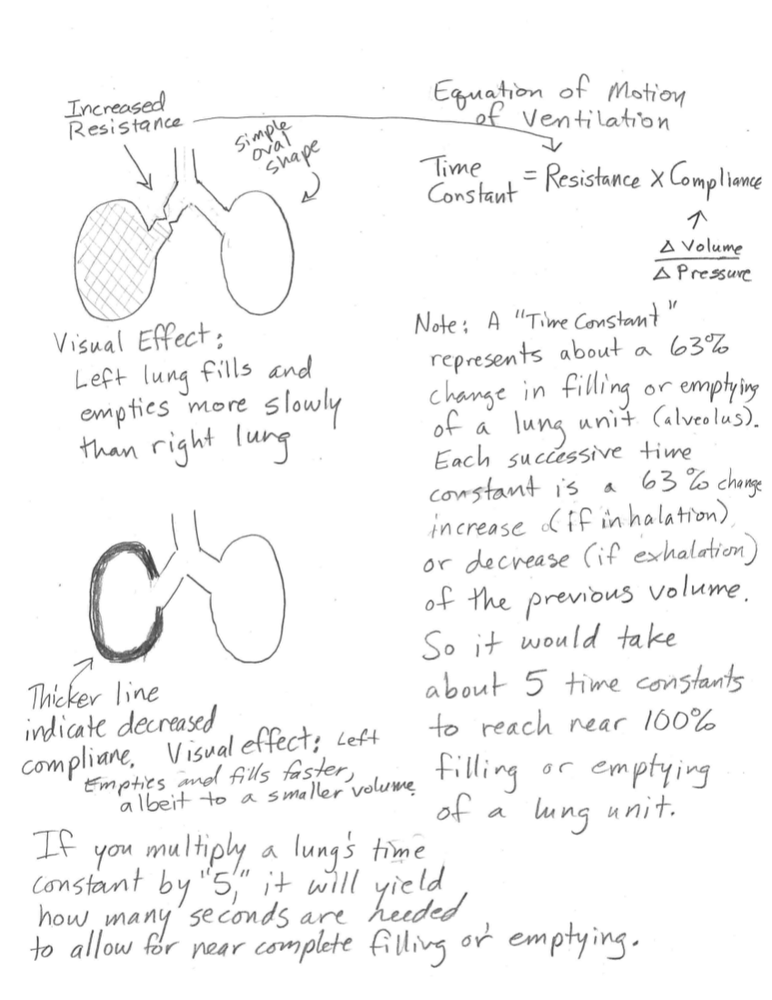

How Changing a Respiratory Time Constant Affects Breathing
==========================================================

A webapp to visualize how compliance and resistance affect breathing.

*Christopher Waugh and Jonathan Waugh*