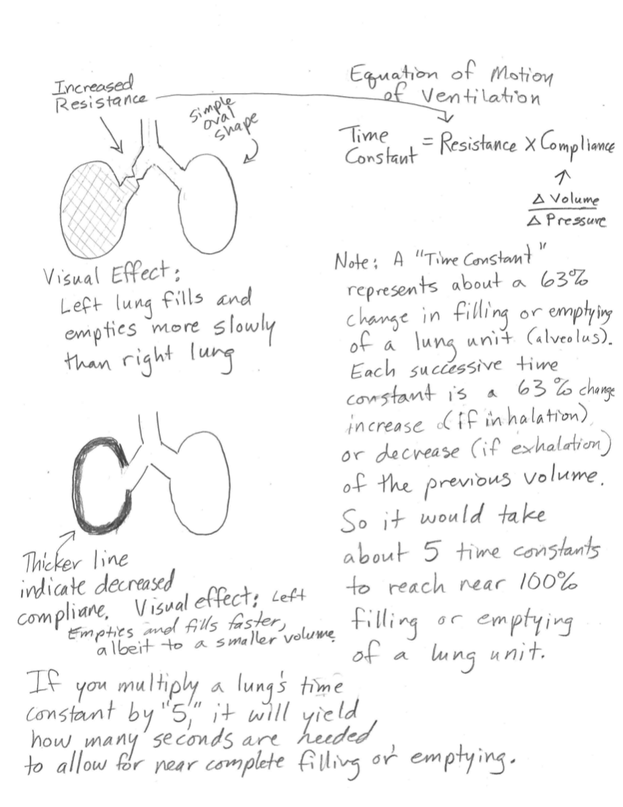

How Changing a Respiratory Time Constant Affects Breathing
==========================================================

A webapp to visualize how compliance and resistance affect breathing.

How respiration is visualized:
------------------------------

* $time constant = resistance \times compliance$
* Every timeconstant, lung progresses 63% towards inhale/exhale
* The lung is modeled such that $height\times width\times depth = volume$.
	* Depth is not depicted
* When the volume of a lung chenges, its dimensions are re-calculated
	* Lung depth is considered constant
	* The change in lung width is 20% the change in lung height
* Compliance changes lung outline
	* Line thickness is inversely proportional to compliance
* Compliance changes lung size
	* Tidal volume is scaled by $\sqrt{compliance}$
* Resistance narrows bronchiole
	* Width of bronchiole is inversely proportional to resistance

*Christopher Waugh and Jonathan Waugh*

